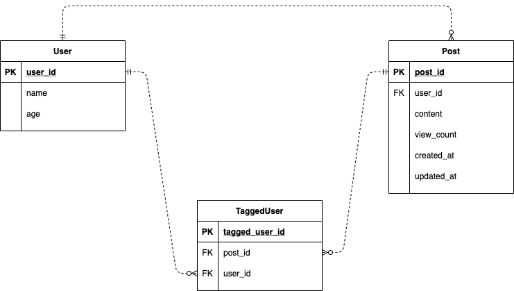

# Search Application

## 

## DB 설계


## API 명세

### Posts
|Method|URL|Param|Return|
|---|---|---|---|
|POST|/posts|content : String </br> user-id : Long </br> taggedUserIds : [Long]| id : Long|
|GET|/post/list?keyword=""?user-id=""|keyword : String| |
- GET /post/list?keyword=""?user-id="" 의 응답
```json
{
  data: [
    {
      userId: Long
      userName: String,
      content: String
      taggedUsers: [
        {
          userId: Long
          userName: String
        }
      ]
    }
  ],
  corrected: [
    {
      from: String
      to: String
    }
  ],
  censored: Boolean
}
```

### User
|Method|URL|Param|Return|
|---|---|---|---|
|POST|/user|name : String </br> age : Long|id : Long|
|GET|/user/tagged-posts| | |

