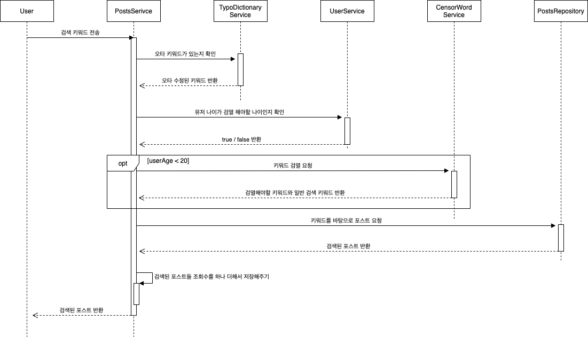

# Search Application

## 검색 알고리즘
### 유스 케이스
**유스 케이스 명** : 키워드를 기반으로 원하는 컨텐츠 검색  
**일차 액터** : 검색 기능 사용자  
**주요 성공 시나리오**
1. 키워드가 Typo에 해당하지 않으면 3으로 이동.
2. 키워드의 오타 교정
3. 키워드로 검색
    - 오타 교정한다면, **스프륑** 책 **직거레** -> **스프링** 책 **직거래**
    - 이를 띄어쓰기 기준으로 분할한다. → [스프링, 책, 직거래]
    - 위 네 개의 분할된 단어들을 Post가 포함하고 있는지 확인. Post가 이 단어들을 하나라도 포함한다면  Post 리스트에 들어간다.
4. 검색된 Post 리스트에 검열단어가 포함되어 있는 Post가 존재하지 않을 경우, 7으로 이동. (검열 테이블의 가장 최신 Row 기준)
    - 검색어에 검열단어가 존재하지 않더라도, Post 콘텐츠에 검열단어가 들어가면 검열 대상임.
5. user가 19세 이상일 경우 7로 이동
6. user가 19세 미만일 경우 필터
7. Post 리스트를 최신 정렬 기준에 따라 정렬
8. Post들의 조회수를 하나씩 증가시킴

### 시퀀스 다이어그램


## DB 설계


## API 명세

### Posts
|Method|URL|Param|Return|
|---|---|---|---|
|POST|/posts|content : String </br> user-id : Long </br> taggedUserIds : [Long]| id : Long|
|GET|/post/list?keyword=""?user-id=""|keyword : String| |
- `GET /post/list?keyword=""?user-id=""` 의 응답
```json
{
  "data": [
    {
      "userId": "Long",
      "userName": "String",
      "content": "String",
      "taggedUsers": [
        {
          "userId": "Long",
          "userName": "String"
        }
      ]
    }
  ],
  "corrected": [
    {
      "from": "String",
      "to": "String"
    }
  ],
  "censored": "Boolean"
}
```

### User
|Method|URL|Param|Return|
|---|---|---|---|
|POST|/user|name : String </br> age : Long|id : Long|
|GET|/user/tagged-posts| | |

